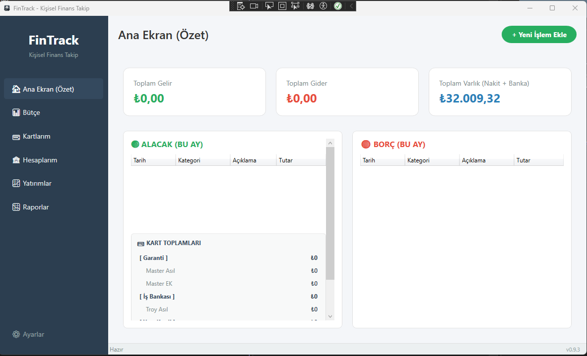

> [!IMPORTANT]
> **Hybrid Çalışma Stratejisi:** Bu proje geliştirilirken derleme (dotnet build), çalıştırma (F5) ve manuel hata ayıklama süreçleri kullanıcı tarafından Visual Studio üzerinden yürütülür. AI asistanı mimari, mantık ve karmaşık kod yazımına odaklanır.

> [!NOTE]
> **Güvenlik ve Şifreleme Notu:** FinTrack veritabanı SQLCipher ile tam şifrelidir. Veritabanına erişim sırasında alınan "file is not a database" gibi hatalar, şifreleme anahtarının (ActiveDataKey) eksik olduğunun göstergesidir. Bu bir açık değil, aksine verilerinizin şifresiz erişime kapalı olduğunun en büyük kanıtıdır.

All notable changes to this project will be documented in this file.

---

## 📋 FinTrack Geliştirme Planı (Update Plan)

Bu doküman, FinTrack projesine eklenecek yeni özellikleri, geliştirme fikirlerini ve tamamlanan aşamaları tek bir çatı altında takip etmek için oluşturulmuştur.

### ✨ Tamamlanan Özellikler

## [2.0.0-beta.6] - 2026-06-14 — Faz 16: Kripto Para Optimizasyonları ve Esnek Portföy Yönetimi

### Added
- **Kripto Para ve Küsürat Hassasiyeti**: PEPE, FLOKI gibi düşük değerli kripto paralarda yuvarlama sorunlarını önlemek adına fiyat ve maliyet gösterimleri 8 ondalık basamaklı (0.00000000) detaylı yapıya kavuşturuldu.
- **Dinamik Kripto Kazıyıcı (Akıllı Fallback)**: "S" (Sonic) gibi ana piyasa ekranında yer almayan kripto paralar için, arka planda doğrudan coinin özel sayfasına giderek fiyatı tespit edebilen akıllı eşleştirme (slug) algoritması eklendi.
- **Kişiselleştirilmiş Otomatik Tamamlama (Autocomplete)**: Yatırım Ekleme ekranındaki sembol arama kutusu, artık global varlıklardan önce kullanıcının *kendi portföyündeki* varlıkları tarayıp listenin en üstüne getiriyor. Yeni işlem eklemek çok daha hızlı hale getirildi.
- **Sınırsız Varlık Desteği**: Listelerde bulunmayan yepyeni bir varlığın bile sadece adını ve sembolünü yazarak alınabilmesi, sistemin de bu yeni varlığı hafızasına alıp anında fiyat bulması (Web Scraping) güvence altına alındı.

## [2.0.0-beta.5] - 2026-06-14 — Faz 15: Gerçek Fiyat Hafızası ve Geçmiş Grafiği

### Added
- **Fiyat Hafızası (LastKnownPrice)**: Varlıkların veritabanına daha önce eklenen `LastKnownPrice` sütunları aktif edildi. Uygulama açıldığında veya Yatırımlar sekmesine girildiğinde artık maliyet fiyatına sıfırlanmak yerine son bilinen güncel fiyatlar ekrana yansıtılıyor.
- **Otomatik Fiyat Güncellemesi**: Kullanıcının "Fiyatları Çek" butonuna basmasına gerek kalmadan, uygulama açıldığı an arka planda sessiz bir API tetikleyicisi fiyatları eşitleyecek şekilde programlandı.
- **Gerçek Zamanlı Fiyat Geçmişi (PriceHistory)**: Yeni veya eski yatırımların çekilen her anlık fiyatı, veritabanındaki `PriceHistory` tablosuna günlük (Low, High, Close) formatında kaydedilmeye başlandı. 
- **Veri Odaklı Grafikler (Sparklines)**: Uygulamadaki rastgele çizilen çizgisel fiyat grafikleri tamamen iptal edildi. Artık tüm grafikler `PriceHistory` tablosunda gün gün biriktirilen sizin gerçek fiyat hareketlerinizi (Geçmiş) kullanarak ekrana yansıtılıyor.

### Fixed
- **İşlem Geçmişi Tablo Görünümü**: Avalonia platformunda eksik kalan `DataGrid` (Tablo) stil kütüphanesi sisteme entegre edildi, böylece yatırım detaylarındaki "İşlem Geçmişi" görünür kılındı.
- **Tarih Sütunu Kesilmesi**: İşlem detay tablosundaki (DataGrid) "Tarih" sütunu ve diğer sütun genişlikleri piksel olarak iyileştirildi; yıl verilerinin (`24.03.2024` yerine `24.03.202` görünmesi) kesilmesi engellendi.
- **Manuel Ortalama Düzeltme**: Kullanıcının geçmiş portföy kayıtlarına yönelik "Açılış/Ortalama Maliyet" ve geçmiş alım fiyatları veritabanında toplu olarak istenen güncel değerlerle senkronize edildi.

## [2.0.0-beta.4] - 2026-06-14 — Faz 14: Akıllı Fiyat Sağlayıcıları ve Dinamik Sembol Arama

### Added
- **Web Scraper (Kazıyıcı) Entegrasyonu**: Kategori bazlı fiyat API ayarlarına yeni bir "Web Scraper" seçeneği eklendi. Arka planda Borsa.Doviz.com, Altin.Doviz.com ve Kur.Doviz.com sitelerinin canlı sayfalarından fiyat çeken dinamik bir yapı kuruldu.
- **Dinamik Özel API Görünürlüğü**: API ayarlarında "Özel API" seçildiğinde anında ekranda "Özel API URL" metin kutusunun belirmesini sağlayan dinamik (IsVisible) tetikleyici eklendi.
- **Kategori Bazlı Scraper İsimlendirmesi**: API seçim listesinde artık her kategori kendi kaynağını net bir biçimde (Örn: Web Scraper (Altin.Doviz.com)) gösteriyor.
- **Dinamik Sembol Arama (AutoComplete)**: Yatırım Ekleme/Satın Alma ekranına Avalonia `AutoCompleteBox` entegre edildi. "Hisse", "Altın" veya "Döviz" seçildiğinde, sağlayıcılardan o saniye tüm güncel semboller (Hisseler, Kur Çeşitleri) çekiliyor. Sembol araması yapılıp listeden bir varlık seçildiğinde (Örn: FENER) sembol ve uzun ismi otomatik dolduruluyor.

## [2.0.0-beta.3] - 2026-06-14 — Faz 13: İşlem Düzenleme, Detaylı Bakiyeler ve Sıralama İyileştirmeleri

### Added
- **İşlem Düzenleme ve Silme**: Hesap detayları ekranına (`AccountDetailWindow`) her işlem satırı için Düzenle (✏️) ve Sil (🗑️) butonları eklendi. İşlem Düzenleme için modern bir ekran (`EditTransactionWindow` ve `EditTransactionViewModel`) oluşturuldu.
- **Maaş Gününe Göre Dinamik Dashboard**: Aylık özet ve işlem listelerinde, ilgili ayın başlangıcını bir önceki ayın son iş günü ve bitişini ise içinde bulunulan ayın son iş günü yapacak şekilde dinamik tarih sınırları entegre edildi (`GetLastBusinessDayOfMonth`).
- **Toplam Varlık Hesaplaması**: Dashboard üzerinde dinamik olarak nakit, banka ve yatırım bakiyelerini içeren gerçek "Toplam Varlık" hesaplaması aktifleştirildi.
- **Kararlı Aynı Gün Sıralaması**: Aynı gün içerisinde girilen veya düzenlenen işlemlerin sıralamasında, tarih ve saat eşitliği durumunda veri tabanı kayıt sırasını (`Id` alanı) ikincil sıralama ölçütü olarak kullanan `ThenByDescending(t => t.Id)` mantığı eklendi.
- **Canlı Borsa Fiyatları (API) Entegrasyonu**: Yatırımlar ekranındaki "Fiyatları Çek (API)" butonu aktifleştirilerek, hisse senetleri (Yahoo Finance) ve altın/döviz (GenelPara) verilerinin akıllı rotalama servisi üzerinden anlık olarak çekilmesi ve kâr/zarar durumunun hesaplanması sağlandı.
- **Yatırım İşlem Geçmişi (Detay) Ekranı**: Yatırımlar tablosundaki her hisse için "İşlemler" butonu aktif edildi. Bu buton sayesinde o hisseye ait geçmişteki tüm alım/satım işlemlerinin (tarih, fiyat, lot adedi, masraf ve toplam tutar) detaylı olarak incelenebildiği `InvestmentDetailWindow` erişilebilir hale getirildi.

### Fixed & Improved
- **Senkronize Transfer Yönetimi**: Bir transfer işlemi düzenlendiğinde veya silindiğinde, aynı "Grup ID"ye sahip karşı hesaptaki bağlantılı kaydın (tarih, tutar, açıklama ve silinme durumu) otomatik olarak arka planda eşzamanlanması sağlandı. Silme öncesi özel uyarı diyaloğu eklendi.
- **Anlık Arayüz Yenileme (Refresh)**: Hesap detayları (`AccountDetailWindow`) ekranında işlem yapılıp (düzenleme/silme) pencere kapatıldığında, arka plandaki "Hesaplarım" ekranının menü değiştirmeye gerek kalmadan kendi kendini anında tazelemesi sağlandı.
- **Hesaplarım Ekranı Scrollbar Düzeltmesi**: Banka hesapları listesinde ekranın altına taşan hesaplara ulaşılamama sorunu, `StackPanel` yerine `Grid` kullanılarak çözüldü ve listeye otomatik `VerticalScrollBar` kazandırıldı.
- **Dashboard DataGrid Yükleme Sorunları**: WPF'ten kalan ve Avalonia'da listenin boş görünmesine neden olan DataGrid şablonları, modern ItemsControl şablonları ile yenilenerek gelir, gider ve transfer listelerinin düzgün görünmesi sağlandı.

## [2.0.0-beta.2] - 2026-06-14 — Faz 12: Hesap Yönetimi ve Transferler

### Added
- **Hesapları Yönet Ekranı**: Yeni banka hesaplarının eklenebildiği (Açılış Bakiyesi ve IBAN desteği ile), mevcut hesapların aktif/pasif durumlarının değiştirilebildiği ve silinebildiği modüler pencere eklendi (`ManageAccountsWindow`).
- **Hesaplar Arası Transfer**: Nakit (Cüzdan) ve banka hesapları arasında tutar aktarımını sağlayan; arka planda giden ve gelen iki ayrı işlem oluşturan Transfer ekranı yapıldı (`TransferWindow`).
- **Hesap Detayları Ekranı**: Seçilen banka hesabının veya cüzdanın tüm geçmiş işlemlerini (gelir, gider, transfer ve yatırım alış/satış) listeleyen ve güncel bakiyesini gösteren detay sayfası oluşturuldu (`AccountDetailWindow`).
- **IBAN Formatlayıcı (IbanConverter)**: IBAN alanlarına değer girilirken veya okunurken dörderli gruplar halinde otomatik boşluk bırakan Avalonia IValueConverter yazıldı. Avalonia'nın cursor atlama sorunlarını engellemek adına doğrudan Binding katmanına uygulandı.
- **Tutar Alanlarında Otomatik Formatlama**: Para Transferi (`TransferWindow`) ve Yeni İşlem Ekle (`AddTransactionWindow`) ekranlarındaki tutar kutularına odak kaybolduğunda (Lost Focus) otomatik olarak binlik ayracı ve `,00` kuruş hanesi getiren (`30.000,00` gibi) formatlama desteği eklendi.
- **Güvenli Tutar Çözümleme**: Girilen formatlanmış değerlerin veritabanına sorunsuz şekilde kaydedilebilmesi için asenkron işlemler katmanındaki sayı çözümleme (parsing) altyapısı nokta ve virgül içeren girdileri doğru algılayacak şekilde güçlendirildi.

## [2.0.0-beta.1] - 2026-05-21 — Faz 11: Diyaloglar, Tema ve WPF'in Emekliliği

### Added
- **Modern Hata ve Bilgi Diyalogları**: `ErrorDialogWindow` ve `InfoDialogWindow` Avalonia altyapısına taşındı. Yuvarlatılmış köşeler, kutu gölgeleri ve yüksek kontrastlı modern bir arayüz (UI) tasarımı uygulandı.
- **Tema Seçimi (Dark/Light Mode)**: `SettingsView` ekranına "🎨 Görünüm" sekmesi eklendi. Sistem, Aydınlık ve Karanlık tema seçenekleri sunularak uygulamanın tasarım renginin anlık olarak ve kalıcı bir şekilde (`settings.json` aracılığıyla) değişebilmesi sağlandı.
- **WPF Projesinin Emekliye Ayrılması**: Tüm uygulama baştan aşağı cross-platform Avalonia mimarisine taşındığı için, eski `FinTrack.WPF` projesi çözümden (solution) tamamen çıkarıldı ve kaynak kodları silindi. FinTrack artık sadece Windows'ta değil, Linux ve macOS platformlarında da çalışmaya tam uyumlu hale geldi.

## [2.0.0-alpha.6] - 2026-05-21 — Faz 10: Platform Servisleri ve Cross-Platform Adaptasyonu

### Added
- **Otomatik Kilitleme Servisi (AutoLock)**: Uygulama belli bir süre (kullanıcı belirler) hareketsiz kaldığında ekranı kilitleyen yapı cross-platform hale getirildi. `CrossPlatformAutoLockService.cs` ile Avalonia `InputElement.AddClassHandler<TopLevel>` yapısı kullanılarak fare ve klavye girdileri işletim sisteminden bağımsız (Windows, Linux, Android) dinlenir hale getirildi.
- **Cross-Platform Güncelleyici Modülü (GitHub Updater)**: WPF sürümündeki arka planda çalışan ve sadece Windows'ta `.bat` script ile uygulamanın `.exe` dosyasını üzerine yazan güncelleyici iptal edildi. Yerine, Linux ve Android ile de tamamen uyumlu olacak şekilde, sürüm uyarısı gösteren (`UpdateAvailableWindow.axaml`) ve işlemi "kullanıcının varsayılan tarayıcısında indirme sayfasını açarak" güvenli yoldan halleden yapı kuruldu.
- **Güvenli Dosya Yolu Referansları**: Uygulamanın SQLite veritabanı yolu, yedeklemeler ve ayar dosyaları `.NET`'in kendi `Environment.SpecialFolder` enum'larını kullanarak (örneğin Linux'ta `~/.local/share` veya Windows'ta `%APPDATA%`) platform bağımsız hale getirildi. Ek işlem gerektirmeden tam uyumluluk doğrulandı.

## [2.0.0-alpha.5] - 2026-05-21 — Faz 9: Ayarlar Ekranı ve Kategori Yönetimi

### Added
- **Modüler Ayarlar Ekranı (Faz 9)**: `SettingsView.axaml` ve `SettingsViewModel.cs` kullanılarak WPF'teki ayarlar ekranı Avalonia'ya taşındı. Güvenlik, Kategoriler, Yedekleme, API & Vergi, Kılavuz ve Hakkında sekmelerini içeren sol dikey menü tabanlı modern bir tasarım oluşturuldu.
- **Kategori Hiyerarşisi Yönetimi**: Avalonia UI üzerinde `CategoryEditWindow.axaml` ile alt/üst kategori ilişkilerini düzenleme, kategorileri gizleme ve görünür yapma yetenekleri kazandırıldı. Listelerde alt kategoriler için indentasyon (boşluk) ve özel stiller (italik/normal) eklendi.
- **Bulut Yedekleme Altyapısı**: Ayarlar ekranında veritabanı klasörü ve otomatik yedekleme dizini (Google Drive vb.) seçimi için Avalonia'nın native `StorageProvider.OpenFolderPickerAsync` API'si entegre edildi.
- **Genel Onay Diyaloğu (`ConfirmDialog`)**: Dinamik başlık ikonlarına (Uyarı, Hata, Başarılı vs.) ve yüksek kontrastlı (kırmızı/mavi) buton desteğine sahip platform bağımsız bilgilendirme/onay ekranı eklendi.
- **Özel UI Dönüştürücüler**: Ayarlar ekranındaki karmaşık UI mantığı (Income/Expense renkleri, seçili sekme görünürlüğü vb.) için `SettingsConverters.cs` altında özel Avalonia `IValueConverter` sınıfları yazıldı.
- **Ana Menü Navigasyonu**: `MainAppView` üzerindeki Ayarlar butonu aktif hale getirilip `SwitchToSettingsCommand` ile ana ekran akışına bağlandı.

## [2.0.0-alpha.4] - 2026-05-19 — Faz 8: Bütçe, Raporlar ve Vergi Entegrasyonu

### Added
- **Bütçe Yönetim Ekranı (Faz 8)**: `BudgetView.axaml` ve `BudgetViewModel.cs` sıfırdan yazıldı. Kategori bazlı harcama limitleri, enflasyon (TÜİK TÜFE) oranı güncellemesi ve asenkron MVVM işlemleri kuruldu.
- **Raporlama Modülü**: Tarih bazlı gider analizleri, yüzdelik ilerleme durumları ve 6 aylık trend barları `ReportsView.axaml` ve `ReportsViewModel.cs` ile tamamlandı.
- **Yatırım Vergi Raporu**: Varlık satış kârları ve temettü gelirlerine göre yıla ait vergi dökümünü (`DataGrid`) gösteren `TaxCalculationWindow` entegre edildi.
- **Navigasyon Bağlantısı**: Sol menü (Sidebar) üzerinden Bütçe ve Raporlar sayfaları aktif edildi, Yatırımlar ekranı üzerinden Vergi Raporu modal penceresi tetiklendi.

### Fixed
- **Tarih Filtresi Değişiklik Tetikleyicisi**: Ana ekranda (Dashboard) üst kısımdan ay veya yıl filtresi değiştirildiğinde verilerin güncellenmemesi sorunu, `MainAppViewModel`'e property change hook'ları (`OnSelectedMonthIndexChanged` & `OnSelectedYearChanged`) eklenerek ve seçilen tarihler asenkron olarak `DashboardViewModel.LoadDataAsync` metoduna beslenerek düzeltildi.
- **CalendarDatePicker Tür Uyuşmazlığı**: Raporlar ve Analiz ekranında başlangıç ve bitiş tarihlerini seçerken oluşan `InvalidCastException` hatası, `ReportsViewModel` tarihlerinin `DateTime?` tipine çekilmesiyle giderildi.
- **CS8604 Nullability Hatası**: `ShowDialog` metodundaki olası null referans uyarısı giderildi.
- **AVLN5001 Eskimiş API Uyarısı**: `AddTransactionWindow.axaml` üzerindeki `Watermark` özniteliği `PlaceholderText` ile değiştirildi.

## [2.0.0-alpha.3] - 2026-05-19 — UX İyileştirmeleri ve Hata Düzeltmeleri

### Added
- **Genel Yatırım Portföyü**: Ana ekranda (Dashboard) yer alan "Kripto Portföyü" kartı, tüm yatırım varlıklarını (Altın, Döviz, Hisse, Kripto vb.) kapsayacak şekilde "Yatırım Portföyü" olarak genişletildi. WPF ve Avalonia UI projelerinde tam entegrasyon sağlandı.
- **Nakit (Kasa) Görünürlüğü**: "Yatırım Alışı" ekranındaki "Ödeme Kaynağı (İsteğe Bağlı)" seçeneği, kullanıcının mevcut nakit bakiyesini (Cüzdan/Kasa) doğrudan görebileceği ve seçebileceği şekilde güncellendi.
- **Modern Hata Bildirimleri**: Yeni profil ekleme ekranındaki (WPF) tüm standart Windows pop-up (MessageBox) pencereleri uygulamanın premium temasına uygun `InfoDialogWindow` tasarımıyla yenilendi.
- **Avalonia Satır İçi Doğrulama (Inline Validation)**: Avalonia UI profil ekleme ekranına modern ve şık tasarımlı satır içi hata mesajı uyarı sistemi eklendi.

### Fixed
- **Profil Üzerine Yazma (Sessiz Hata) Sorunu**: Zaten var olan bir profil ismi (veya mevcut veritabanı adı) ile yeni profil açılmaya çalışıldığında, sistemin işlemi başarılı gösterip arka planda hiçbir şey yapmamasına sebep olan hata giderildi. Artık "Bu isimde bir profil zaten mevcut" şeklinde bilgilendirici uyarı verilerek isim çakışmaları engelleniyor.

## [2.0.0-alpha.2] - 2026-05-19 — Faz 6 & 7: Yatırım Modülleri ve Sparkline Grafik Entegrasyonu

### Added
- **Yatırım Arayüzleri ve Yönetimi (Faz 6)**: WPF'teki tüm yatırım diyalogları Avalonia için asenkron MVVM yapısında sıfırdan yazıldı:
  - `ManageInvestmentsWindow`: Varlık ekleme ve detayları takip etme ana merkezi.
  - `AddInvestmentWindow` & `SellInvestmentWindow`: Varlık alım-satım ve anlık net kar/zarar hesaplama pencereleri.
  - `EditInvestmentAssetWindow` & `InvestmentDetailWindow`: Varlık bilgilerini düzenleme ve ayrıntılı işlem geçmişi pencereleri.
- **Yüksek Performanslı Sparkline Kontrolü (Faz 7)**: WPF'in DirectX/DrawingVisual altyapısı yerine Avalonia'nın native `DrawingContext` ve `StreamGeometry` API'leri kullanılarak sıfırdan `AvaloniaSparklineControl` yazıldı. Trend renklendirme (yeşil/kırmızı), gradyan dolgu ve interaktif crosshair/tooltip özellikleri eklendi.
- **Tarih Seçici İyileştirmesi (CalendarDatePicker)**: Ekranda çok geniş yer kaplayan ve taşma yapan varsayılan `DatePicker` kontrolleri, şık bir takvim açılır kutusu sunan `CalendarDatePicker` ile değiştirildi.
- **Kaydırılabilir Form Yapısı (ScrollViewer)**: Yatırım pencerelerine `ScrollViewer` entegre edilerek küçük ekranlarda form elemanlarının üst üste binmesi engellendi ve pencere yükseklikleri dinamik hale getirildi.

### Fixed
- **Tarih Dönüşüm Hatası (`InvalidCastException`)**: `CalendarDatePicker`'ın `SelectedDate` özelliği (`DateTime?`) ile Viewmodel'deki `DateTimeOffset?` arasında oluşan runtime tip uyuşmazlığı giderildi; tüm seçili tarihler `DateTime?` tipine geçirildi.
- **Veritabanı Çakışmaları ve Dosya Kilidi**: Derleme sırasında Visual Studio veya uygulamanın açık kalmasından kaynaklanan dll erişim kilidi sorunları giderildi.
- **DataGrid Hataları**: Avalonia v11 DataGrid kontrolünde desteklenmeyen legacy WPF özellikleri (`CanUserAddRows`, `AlternatingRowBackground` vb.) AXAML kodlarından temizlendi.
- **Namespace Çakışmaları**: `Interactivity` kütüphanesinin çakışmalarını önlemek için kod tarafında global namespace yönlendirmeleri sağlandı.

## [2.0.0-alpha.1] - 2026-05-10 — Avalonia UI Çapraz Platform Geçişi (Faz 1-5)

### Added
- **Proje Altyapısı (Faz 0)**: `FinTrack.Avalonia` adında yeni bir UI projesi eklendi. .NET 10.0, Avalonia 12.0.2 ve CommunityToolkit.Mvvm paketleri kuruldu. Mevcut `FinTrack.Core` ve `FinTrack.Data` projeleriyle sorunsuz çalışacak şekilde bağlandı.
- **MVVM Altyapısı (Faz 1)**: WPF tarafındaki Code-Behind mimarisinden tamamen vazgeçilip, tüm sayfalar için `ViewModelBase` kalıbı ve Observable özellikler oluşturuldu. Dependency Injection üzerinden `AppDbContext` entegrasyonu sağlandı.
- **Giriş Ekranı (Faz 2)**: `LoginView` ve `AddProfileView` tasarımları WPF versiyonuna birebir sadık kalınarak Avalonia'da yeniden yaratıldı. İlk kurulum ve şifre doğrulama mantıkları MVVM'e bağlandı.
- **Ana Pencere ve Navigasyon (Faz 3)**: Uygulamanın kabuk (Shell) yapısı oluşturuldu. SPA (Tek Sayfa Uygulaması) mantığı ile `LoginViewModel` ve `MainAppViewModel` arasında pürüzsüz geçiş sağlandı. Sol navigasyon (Sidebar) ve global arama/tarih filtresi menüleri aktarıldı.
- **Dashboard (Faz 4)**: `DashboardView` oluşturuldu. `Avalonia.Controls.DataGrid` kullanılarak Gelir, Gider ve Transfer listeleri sayfaya bağlandı. Genel bakiye ve kategori bazlı harcama hesaplamaları asenkron MVVM komutları ile UI'ı kilitlemeden çalışacak şekilde ayarlandı.
- **Hesaplarım ve Kartlarım (Faz 5)**: `AccountsView` ve `CardsView` ekranları sıfırdan oluşturuldu. Ekstre tarihleri, kalan limitler, asıl ve ek kart bakiyeleri dinamik olarak hesaplanarak arayüze (DataBinding) yansıtıldı. Nakit hesaplaması ayrıntılı fonksiyon ile garanti altına alındı.

## [1.3.0] - 2026-05-09 — Faz 3: Performans Grafikleri, Sermaye Artırımı & Vergi Hesaplama

### Added
- **SparklineControl (DrawingVisual)**: WPF'in DirectX hızlandırmalı `DrawingVisual` + `StreamGeometry` altyapısıyla sıfır bağımlılıklı, yüksek performanslı fiyat grafiği kontrolü oluşturuldu. Gradient fill, trend renklendirme (yeşil=kâr, kırmızı=zarar), mouse tooltip, min/max/son fiyat etiketleri destekleniyor.
- **InvestmentDetailWindow Sparkline Grafiği**: Varlık detay penceresine `PriceHistory` tablosundan beslenen interaktif fiyat grafiği eklendi. 1 Ay / 3 Ay / 1 Yıl / Tümü periyod seçenekleri ile farklı zaman aralıkları görüntülenebiliyor.
- **Mini Sparkline (Portföy Kartları)**: Her yatırım varlık kartının alt kısmına 7 günlük mini sparkline çizgisi eklendi. Tek bakışta fiyat trendi görülebiliyor.
- **Sermaye Artırımı (`CapitalActionWindow`)**: Bedelsiz sermaye artırımı (%50 bedelsiz → lot artar, maliyet sıfır), Bedelli sermaye artırımı (rüçhan hakkı kullanımı + maliyet güncelleme) ve Hisse Bölünmesi (1'e 2, 1'e 3 vb.) için ayrıntılı kayıt penceresi oluşturuldu. Sonuç önizleme paneli ile yeni miktar ve ortalama maliyet önceden gösteriliyor.
- **Yeni İşlem Türleri**: `InvestmentTransactionType` enum'ına `BonusShare` (Bedelsiz), `RightsIssue` (Bedelli) ve `Split` (Bölünme) değerleri eklendi. İşlem geçmişinde özel ikonlarla (🔄/📋/✂️) görüntüleniyor.
- **Vergi Hesaplama Raporu (`TaxCalculationWindow`)**: Yıl bazlı satış kazancı ve temettü geliri vergi projeksiyonu. Özet kartları (Toplam Kazanç, Tahmini Vergi, Temettü Geliri, Net Getiri) ve detaylı işlem tablosu.
- **Değiştirilebilir Vergi Oranları**: `Ayarlar > API ve Entegrasyonlar` sekmesine kategori bazlı vergi oranları (Hisse %0, MKYO %10, Temettü %15, Döviz %0, Altın %0, Kripto %0, Yurt Dışı %0) bölümü eklendi. `settings.json`'a kaydediliyor.
- **SettingsManager Genişletildi**: `TaxRate*` property'leri, `GetTaxRateForCategory()`, `GetDividendTaxRate()`, `SaveTaxSettings()` metodları eklendi.

### Changed
- **InvestmentDetailWindow**: Tam yeniden tasarım — sparkline grafiği, periyod butonları, "Sermaye İşlemi" butonu ve genişletilmiş işlem geçmişi tablosu (yeni türler dahil).
- **InvestmentsView**: "📊 Vergi Raporu" butonu eklendi, her karta mini sparkline bağlandı.

### Design Decisions
- **Harici Kütüphane Yok**: Grafik çizimi tamamen WPF built-in `DrawingVisual` ile yapıldı — LiveCharts/OxyPlot gibi ağır paketler eklenmedi.
- **Migration Gerekmez**: Enum değerleri integer olarak saklandığından yeni işlem türleri DB şemasını değiştirmez.
- **Türkiye 2026 Vergi Kuralları**: BIST hisse alım-satım stopajı %0, MKYO %10 (1 yıl altı), temettü %15 varsayılan olarak ayarlandı.

---

## [1.2.0] - 2026-05-08 — Faz 2: Fiyat Kalıcılığı, API Çoklu Kaynak & Temettü

### Added
- **Fiyat Geçmişi Tablosu (`PriceHistory`)**: Yatırım varlıklarının günlük kapanış (Close), en düşük (Low) ve en yüksek (High) fiyatlarını kalıcı olarak saklayan yeni veritabanı tablosu eklendi. Sembol + Tarih bazlı `Unique Index` ile günde 1 kayıt kuralı uygulandı.
- **GenelPara API Entegrasyonu**: Döviz ve altın fiyatlarını TRY bazlı olarak çeken yeni API sağlayıcısı eklendi (`api.genelpara.com`). USD, EUR, GBP gibi dövizler ve Gram/Çeyrek/Yarım/Tam altın destekleniyor.
- **Kategori Bazlı Akıllı API Rotalama (`FetchPriceSmartAsync`)**: Her varlık kategorisi (Döviz, Altın, Hisse, Kripto, Fon, Diğer) için ayrı fiyat sağlayıcı seçilebilen akıllı rotalama sistemi eklendi. Döviz→GenelPara, Hisse→Yahoo Finance gibi kombinasyonlar yazılımdan değişiklik gerektirmeden ayarlanabiliyor.
- **Dinamik API Ayarları UI**: Ayarlar > "🌍 API ve Entegrasyonlar" sekmesi tamamen yenilendi. Eski tek dropdown yerine 6 adet kategori bazlı (💱 Döviz, 🥇 Altın, 📈 Hisse, 🪙 Kripto, 🏦 Fon, 📦 Diğer) sağlayıcı seçim ComboBox'ı ve önerilen ayarlar bilgi kutusu eklendi.
- **Temettü (Dividend) Takibi**: Yeni `Dividend` işlem türü, `AddDividendWindow` ile stopaj hesaplamalı ve net gelir önizlemeli temettü kayıt penceresi eklendi.
- **Dashboard Portföy Entegrasyonu**: "Toplam Varlık" kartına yatırım portföy değeri (📈 Portföy: ₺...) otomatik entegre edildi.
- **SettingsManager Genişletildi**: `ApiProviderType.GenelPara` enum değeri, `GetProviderForCategory()`, `SaveCategoryProviders()` metodları ve 6 adet kategori bazlı provider property (`DovizProvider`, `AltinProvider`, `HisseProvider`, `KriptoProvider`, `FonProvider`, `DigerProvider`) eklendi.
- **Veritabanı Migrasyonu**: `AddPriceHistoryTable` migrasyonu başarıyla oluşturuldu ve uygulandı.

### Changed
- **Fiyat Çekme Mantığı**: `InvestmentsView` artık `FetchRealTimePriceAsync` yerine `FetchPriceSmartAsync` kullanıyor. Her varlık kendi kategorisine göre doğru API'den fiyat çeker.
- **API Butonu Görünürlüğü**: "🌐 Fiyatları Çek" butonu artık Manuel olmayan herhangi bir kategori provider'ı varsa otomatik görünür.
- **Fiyat Kaynak Takibi**: `PriceHistory` tablosundaki `Source` alanı, verinin hangi API'den geldiğini ("Yahoo", "GenelPara", "Manuel") kaydediyor.

### Design Decisions
- **Hibrit API Stratejisi**: Döviz/Altın için GenelPara (TRY bazlı, hesaplama gerektirmez), Hisse için Yahoo Finance (BIST .IS uzantısı) önerilir.
- **Günlük Kayıt Prensibi**: PriceHistory veri hacmini kontrol altında tutmak için günde 1 kayıt (Close/Low/High) yaklaşımı benimsendi.
- **Ayarlar `settings.json` Üzerinden**: Tüm API tercihleri JSON üzerinden yönetiliyor, yazılım değişikliği gerektirmiyor.

---

- **[x] Askeri Düzey Veritabanı Şifreleme (PBKDF2 & Salt)**
  *Tarih: 2026-03-01*
  FinTrack veritabanı daha önce standart yöntemlerle şifrelenirken, güvenlik seviyesi artırılarak yeni endüstri standardı olan PBKDF2 algoritmasına geçirildi. Kaba kuvvet (brute-force) saldırılarına karşı tam koruma sağlandı.

- **[x] Otomatik Yedekleme (Auto-Backup) Sistemi**
  *Tarih: 2026-03-01*
  Olası veri kayıplarını önlemek adına kullanıcı uygulamayı her kapattığında veritabanının şifreli bir yedeğini istenilen bir klasöre (örn. OneDrive, Google Drive) kopyalayan akıllı bir yedekleme sistemi ve ilk kurulum asistanı eklendi.

- **[x] Otomatik Kilitleme (Auto-Lock / Gelişmiş Güvenlik)**
  *Tarih: 2026-03-01*
  Kullanıcı bilgisayar başından kalktığında veya uygulama arka planda belirlenen süre (varsayılan 3 dakika) boyunca hareketsiz kaldığında ekranı kilitleyen "Oturum Zaman Aşımı" güvenlik modülü entegre edildi.

- **[x] Uygulama İçi Otomatik Güncelleme (Auto-Updater)**
  *Tarih: 2026-03-01*
  GitHub Releases API üzerine kurulu, tamamen maliyetsiz ve çok hızlı bir uygulama içi güncelleme motoru entegre edildi. Uygulama açılışta yeni sürümü denetleyip dilerse kendi kendini güncelleyebilir duruma getirildi.

---

### 🟡 Sonraki Aşamalar İçin Planlanan Özellikler (Faz 9 & Sonrası)

Aşağıdaki özellikler, uygulamanın teknik altyapısı, kullanıcı deneyimi ve platform bağımsızlığı göz önünde bulundurularak önceliklendirilmiştir.

- [x] **🔍 Akıllı Arama ve Filtreleme (Global Search)** (Faz 3 kapsamında tamamlandı)
  İşlem sayınız binlere ulaştığında spesifik bir harcamayı bulmak zorlaşabilir. Ana ekrana veya sol menüye her yerde çalışan bir "Hızlı Arama Çubuğu" eklenebilir. "Market", "1500" veya "Ocak" yazdığınızda anında tüm veritabanını tarayıp ilgili gelir/gider/transfer kayıtlarını listeleyebilir.

#### 2. 🧪 Otomatik Testlerin (Unit Tests) Kurulması
Gelecekte projeye eklenecek yeni özelliklerin mevcut sağlam yapıyı bozmadığından emin olmak (Regresyonları önlemek) için `FinTrack.Tests` adında bir xUnit test projesi oluşturulabilir. Özellikle yazdığımız `CryptoProvider` ve fatura/bütçe hesaplama mantıkları otomatik testlere bağlanmalıdır. Bu adım, daha karmaşık özelliklere geçmeden projenin çekirdeğini güvenceye alacaktır.

#### 3. 📥 Manuel İçe Aktarma (Data Import 1.0)
Bankalardan indirilen standart CSV veya Excel (.xlsx) hesap dökümlerini okuyup uygulamaya aktarabilen temel bir içe aktarma altyapısı kurulmalıdır. Bu özellik, gelecekteki "Akıllı Ekstre Aktarımı" vizyonunun temelini oluşturur.

#### 4. 🌙 Karanlık Mod (Dark Theme) Desteği
Şu an uygulamamız premium ve aydınlık (Light) bir tasarıma sahip. Kullanıcı deneyimini (UX) bir üst seviyeye taşımak için tek tuşla geçiş yapılabilen tam bir Karanlık Mod (Dark Mode) entegre edilebilir. Tüm grafikler, butonlar ve tablolar göz yormayan koyu gri/gece mavisi tonlarına bürünür.

#### 5. 📄 Gelişmiş Dışa Aktarma (Excel / PDF Export)
Kullanıcılarınız raporları veya hesap geçmişini başka platformlarda analiz etmek veya doğrudan muhasebecilerle paylaşmak isteyebilir. "Raporlar" veya "İşlemler" sekmelerine işlemleri **Excel (.xlsx)**, **.csv** veya **PDF Rapor Çıktısı** olarak indirebilecekleri bir Dışa Aktarma (Export) aracı tasarlanabilir.

#### 6. 🔔 Yinelenen İşlemler ve Hatırlatıcılar (Recurring Transactions)
Her ay aynı gün ödenen "Kira", "Netflix", "Aidat" gibi sabit giderleri her seferinde manuel girmek yerine sisteme "Her ayın 15'inde bu harcamayı otomatik ekle" kuralı tanımlama sistemi geliştirilebilir. Ayrıca fatura günü yaklaşınca ana ekranda ufak bir uyarı ("Yaklaşan 3 ödemeniz var") gösterilebilir.

#### 7. 🔄 Gerçek Cross-Platform (Çapraz Platform) Arayüzüne Geçiş
Şu anda `FinTrack.Core` ve `FinTrack.Data` katmanlarımız Windows'tan bağımsız (macOS ve Linux uyumlu) çalışabilecek şekilde tasarlandı. Ancak arayüzümüz (FinTrack.WPF) sadece Windows'u destekliyor.
Uygulama arayüzünü WPF ile birebir aynı kod yapısına (XAML) sahip olan **Avalonia UI** çerçevesine taşıyabiliriz. Tasarımı bozmadan uygulamanın macOS ve Linux'ta da yerel (native) olarak çalışmasını sağlayabiliriz.

### 🌟 Stratejik Vizyon ve Gelecek Fikirleri (Long-Term Roadmap)

Bu bölüm, FinTrack'in temel özellikleri oturduktan sonra projeyi bir "Akıllı Finansal Asistan" seviyesine taşıyacak uzun vadeli vizyonu temsil eder.

- **Akıllı Ekstre İçe Aktarımı (Smart Import 2.0)**
  - **Yerel ML.NET Entegrasyonu:** Banka açıklamalarını (örn: "Migros", "Shell") otomatik kategorize eden, veriyi dışarı göndermeyen yerel makine öğrenmesi modeli (Data Import 1.0 üzerine inşa edilecektir).
  - **Gizlilik Maskeleme:** İçe aktarma sırasında kart numarası gibi hassas verilerin otomatik tespiti ve temizlenmesi.
  - **Mükerrer Kayıt Kontrolü:** Manuel girilen işlemlerle ekstre verilerinin çakışmasını önleyen akıllı eşleştirme algoritması.

- **Gelişmiş Finansal Hedef Yönetimi (Goal Engine)**
  - **Senaryo Analizleri (What-if):** "Her ay X miktar daha az harcarsam hedefime ne kadar erken ulaşırım?" simülasyonları.
  - **Borç Kar Topu (Debt Snowball):** Mevcut kredi kartı ve kredi borçlarını en hızlı bitirecek ödeme stratejilerinin otomatik hesaplanması.
  - **Dinamik Birikim Önerileri:** Harcama alışkanlıklarına göre "bu ayki tasarrufunu hedefine aktar" şeklinde akıllı bildirimler.

- **Gelişmiş Güvenlik ve Gizlilik Katmanları**
  - **Biyometrik Giriş:** Windows Hello desteği ile parmak izi veya yüz tanıma entegrasyonu.
  - **Mecburiyet Şifresi (Duress PIN):** Baskı altında giriş yapılması durumunda "sahte/boş" veri profilini yükleyen ikincil güvenlik katmanı.
  - **Ekran Koruma:** Uygulama arkaya alındığında veya ekran görüntüsü alınırken hassas verilerin otomatik bulanıklaştırılması.

- **AI Harcama Asistanı ve Analitik**
  - **Abonelik Dedektifi:** Unutulan veya fiyatı artan dijital aboneliklerin (SaaS) tespiti ve kullanıcıya uyarı verilmesi.
  - **Nakit Akışı Tahmini:** Mevcut harcama hızıyla (Burn Rate) maaş gününe kadar olan finansal sağlığın tahmini.
  - **Alım Gücü Takibi:** Varlıkların döviz, altın veya enflasyon karşısındaki gerçek değer değişim analizi.

- **FinTrack Connect (E2EE Senkronizasyon)**
  - **Uçtan Uca Şifreli Eşleme:** Merkezi bir sunucuya ihtiyaç duymadan, kullanıcıların kendi bulut sürücüleri (OneDrive/Drive) üzerinden cihazlar arası güvenli veri senkronizasyonu.

### 🛠️ Geliştirme ve Mimari Prensipler

Projenin sürdürülebilirliği ve güvenliği için aşağıdaki prensipler uygulanacaktır:

- **Modüler Dağıtım:** UI ağırlıklı geliştirmeler (Dark Mode) ile mantık ağırlıklı geliştirmeler (Global Search) farklı sprintlerde ele alınarak test karmaşası önlenecek.
- **Gizlilik Odaklı Analiz:** Kullanıcı alışkanlıkları anonimleştirilmiş ve yerel öncelikli yöntemlerle izlenecek; dış sunuculara veri aktarımı minimumda ve kullanıcı onayıyla yapılacak.
- **Avalonia Dostu Kod Yazımı:** Planla### Added
- **Gelişmiş Kategori Yönetimi**: Ayarlar menüsüne çift panelli (Görünür/Gizli) kategori yönetim sistemi eklendi.
- **Alt Kategori (Hierarchy) Desteği**: Yeni kategori eklerken "Üst Kategori" seçebilme özelliği getirildi. Kategoriler artık "Ana Kategori > Alt Kategori" şeklinde hiyerarşik olarak listeleniyor.
- **Kategori Görünürlük Kontrolü (Soft-Delete)**: Kategorileri silmek yerine gizleyebilme özelliği eklendi. Gizlenen kategoriler harcama pencerelerinde görünmez ancak geçmiş veriler korunur.
- **Görsel Kategori Ayrımı**: Kategori listelerine Gelir için yeşil (💰), Gider için kırmızı (💸) renk belirteçleri ve ikonlar eklendi.
- **Hiyerarşik İndentasyon**: Alt kategoriler, bağlı oldukları ana kategorilerin altında görsel olarak daha içten başlayacak (Indent) şekilde düzenlendi.

### Fixed
- **Hiyerarşik Sıralama Hatası**: Ayarlar sekmesindeki kategorilerin dağınık görünmesine sebep olan alfabetik sıralama mantığı, ana ve alt kategorileri bir arada tutan akıllı sıralama sistemi ile değiştirildi.
- **SQLCipher Bağlantı Hatası**: Ayarlar sekmesinde veritabanına bağlanırken oluşan "file is not a database" (şifreleme anahtarı eksikliği) sorunu, `ActiveDataKey` entegrasyonu ile giderildi.
- **Kategori Türü İyileştirmesi**: Yönetim ekranlarından "Transfer" türü kaldırılarak Gelir/Gider odaklı yapı sadeleştirildi.
- **Kategori Liste Yükleme Sorunu**: `SettingsView` Loaded olayının bağlanmasıyla kategorilerin açılışta boş gelmesi sorunu giderildi.
- **Görsel Tutarlılık**: Kategori görsel standartları (ikon, renk, hiyerarşi) "Yeni İşlem" ve "Düzenle" pencereleriyle tam senkronize hale getirildi.

## [1.0.1] - 2026-03-30

### Added
- **Akıllı Arama ve Filtreleme (Global Search)**: Ana ekrana `Ctrl+K` kısayoluyla da erişilebilen çok yönlü, hap (pill) tasarımlı arama çubuğu eklendi. İşlemler, banka hesapları, kredi kartları ve yatırım varlıkları içerisinde milisaniyelik (300ms debounce) eşzamanlı arama yapılabiliyor.
- **Arama Yönlendirmeleri**: Arama sonuçlarındaki herhangi bir karta tıklandığında, otomatik olarak o harcamanın "Düzenleme Pano"sunu veya o hesabın "Detay Ekranını" açan akıllı navigasyon sistemi entegre edildi.
- **Modern Hata Arayüzü**: Veritabanı erişim/şifreleme hataları gibi teknik `MessageBox` pencereleri iptal edildi. Yerine, Premium FinTrack tasarım diliyle kodlanmış, detaylı hata mesajı sunan `ErrorDialogWindow` arayüzü eklendi.

### Fixed
- **SQLCipher Bağlantı Hatası (PRAGMA key)**: SQLite bağlantısı kurulurken şifrenin parametre bazlı (prepared statement) gönderilmesinden kaynaklanan `SQLite Error 1: near "$key": syntax error` hatası giderildi. Sistem, şifreyi doğrudan veri dizisine gömerek (escaping) güvenli ve hatasız bağlanan bir yapıya kavuşturuldu.
- **Bağlantı Havuzu (Connection Pool) Çakışması**: Veritabanı profilden profile geçerken (`ActiveDataKey` değiştiğinde) şifreli ve şifresiz bağlantıların çakışmasını önlemek için anlık `ClearAllPools()` temizliği sağlandı.

## [1.0.0] - 2026-03-22

### Added
- **İşlem Bazlı Açılış Bakiyesi**: Hesap açılış bakiyeleri artık statik bir değer yerine düzenlenebilir, silinebilir ve görüntülenebilir birer "Açılış Bakiyesi" işlemi olarak takip ediliyor.
- **Otomatik Veri Migrasyonu**: Mevcut tüm hesapların eski açılış bakiyeleri, uygulama başlatıldığında otomatik olarak işlem geçmişine aktarılıyor.
- **Gelişmiş Kilit Ekranı Güvenliği**: Uygulama kilidi devreye girdiğinde içerik tamamen gizlenir (Collapsed) ve kilit ekranı arka planı tam opak hale getirilerek veri sızıntısı engellenir.

### Fixed
- **Bakiye Hesaplama Tutarlılığı**: Açılış bakiyelerinin silinmesi veya değişmesi durumunda tüm hesap özetlerinin ve dashboard verilerinin anlık güncellenmesi sağlandı.
- **WPF Başlangıç Döngüsü (Silent Exit)**: Uygulamanın şifre girildikten sonra sessizce kapanmasına neden olan yaşam döngüsü (`ShutdownMode.OnLastWindowClose`) mantıksal hatası giderildi.
- **Veritabanı Migrasyon Çakışmaları**: "Açılış Bakiyesi" kategorisi (Id: 30) artık sabit ID ile değil, uygulama açılışında dinamik olarak oluşturuluyor. Bu sayede yeni bir veritabanına geçişte veya eski verilerin taşınmasında `Unique Constraint` hatası tamamen giderildi.
- **Global Hata Denetimi**: Uygulamanın en başında (`App.xaml.cs`) unhandled exception yakalayıcı aktif edilerek, olası sistem hatalarının sessizce yutulması yerine kullanıcıya detaylı hata mesajı verilmesi sağlandı.

## [0.9.9] - 2026-03-16

### Fixed
- **Transfer İşlemi Kategori Eşleşmesi**: Banka transferleri ve kredi kartı ödemeleri aynı işlem türünü (`Transfer`) paylaştığı için oluşan kategori karışıklığı giderildi. Artık sistem sadece türe göre değil, kategori adına da ("Hesaplar Arası Transfer" veya "Kredi Kartı Ödemesi") bakarak doğru eşleştirmeyi yapıyor. Bu sayede banka transferlerinin yanlışlıkla "Kredi Kartı Ödemesi" olarak etiketlenmesi engellendi.
- **Transfer İşlemleri Görsel Düzeltmesi**: Kategori listelerinde, düzenleme pencerelerinde ve yeni işlem ekleme menülerinde `Transfer` türündeki kategorilerin sabit olarak "Gider" ("💸" kırmızı ikon) gibi görünmesine sebep olan çekirdek düzeyindeki eşleştirme hatası giderildi. Artık kendi adlarıyla ("Hesaplar Arası Transfer") ve mavi/yenileme ("🔄") ikonuyla ayrışıyorlar. Ayrıca açılır menülerdeki (ComboBox) UI renk noktasının kırmızı (Gider) olarak takılı kalması DataTrigger eklenerek çözüldü, artık mavi (Transfer) renkte listelenecekler.
- **Transfer İsimlendirmesi**: "Transfer" olan genel isimlendirme, kullanıcı deneyimini iyileştirmek için "Hesaplar Arası Transfer" olarak detaylandırıldı.

---

## [0.9.8] - 2026-03-15

### Added
- **Kategori Düzenleme Desteği**: Kategori listelerinde (Görünür/Gizli) sağ tık menüsü (Context Menu) üzerinden kategorileri anlık düzenleme özelliği eklendi.
- **Kategori Edit Paneli (`CategoryEditWindow`)**: Kategorilerin adını değiştirme ve bağlı oldukları "Üst Kategori"yi (Hiyerarşi) güncelleyebilme imkanı sağlandı.
- **Kapsamlı Kullanım Kılavuzu**: Ayarlar menüsündeki kılavuz sekmesi; Nakit Kasa, Akıllı Arama, Taksit Yönetimi ve Kategori Hiyerarşisi gibi tüm güncel özellikleri içeren detaylı rehberlerle zenginleştirildi.

### Fixed
- **XAML Parse & InvalidCastException**: Kategori listelerindeki sağ tık menüsünün (ContextMenu) BAML eşleşme hatası sebebiyle uygulama açılışında oluşan kritik hata giderildi. Menü yapısı merkezi kaynağa (Resource) taşınarak stabilite sağlandı.
- **Görsel Düzenleme**: Kullanım kılavuzundaki etiket (Tag) uyumsuzlukları giderilerek XML doğrulama hataları çözüldü.

## [0.9.7] - 2026-03-14

### Added
- **Nakit Kasa Modülü**: Yalnızca banka hesapları haricinde kalan, fiziksel nakit bakiyelerinin ve işlemlerinin takip edilebilmesi için özel "Nakit Kasa" kartı Hesaplarım paneline entegre edildi.
- **Nakit Kasa Detay Ekranı (`CashDetailWindow`)**: Tüm gelir, gider ve transfer işlemlerinden sadece "Nakit" olarak seçilenleri toplayıp gösteren detylı liste penceresi eklendi.
- **Görsel Renk Kodlaması (`UI FormattedAmount`)**: Kredi Kartı, Banka ve Nakit Kasa detay ekranlarındaki tüm `Tutar` (Amount) sütunları iyileştirildi. Artık harcamalar kırmızı renkli eksi (-) işaretiyle, gelirler ve borç ödemeleri yeşil renkli artı (+) işaretiyle gösteriliyor.

### Fixed
- **Kredi Kartı Borç Ödeme Hatası**: "💸 Borç Öde" panelinden yapılan ödemelerin, kredi kartı borcunu azaltmak yerine matematiksel olarak iki katına çıkarmasına (çift eksileme mantık hatasına) sebep olan kritik hata giderildi. Ödemeler artık bankadan (-) Bakiye, Kredi kartına (+) Bakiye olarak 2 ayrı senkronize transfer işlemi şeklinde kusursuz kayıt ediliyor.
- **Nakit Kasa Transfer Mantığı**: Harcama ve transfer pencerelerinde nakit para kullanıldığında artık bakiyenin anında Nakit Kasadan (veya ilgili bankadan) düşürülmesi ve gerektiğinde "Kasa Eksiye Düşecek" limit aşım uyarısı verilmesi sağlandı.

## [0.9.6] - 2026-03-12
- **Uygulama İçi Kilit Ekranı (In-App Lock Screen)**: Otomatik kilitleme (Auto-Lock) devreye girdiğinde artık tüm Windows ekranı yerine *sadece FinTrack penceresi* kilitleniyor. Bu sayede uygulama kilitliyken bile pencereyi başka bir ekrana taşıyabilir veya arkada kalan diğer programlarınızı engel olmadan kullanabilirsiniz.
- **Yeni Gelir/Gider Kategorisi ("Hatun")**: Kullanıcının eş/partner işlemlerini daha kolay takip edebilmesi için Gelir ve Gider ayrımı olan "Hatun" kategorisi sisteme eklendi.

### Fixed & Changed
- **Banka Hesapları Anlık Güncelleme Hatası (Bakiye Yenileme)**: Üst menüde yer alan "Yeni İşlem Ekle" butonu kullanılarak yeni bir gelir/gider girildiğinde, arka plandaki "Hesaplarım", "Kartlarım" ve "Yatırımlar" ekranlarındaki güncel bakiyelerin otomatik olarak yenilenmemesi (refresh olmaması) sorunu giderildi. Artık işlem kaydedildiği an arayüzdeki bakiyeler anında tazeleniyor ve Hesap Özeti (modal) penceresiyle tamamen tutarlı hale geliyor.
- **Banka Adlarının Görünmemesi**: `Hesaplarım` ekranındaki kartlarda (Örn: Vadesiz Kişisel) hangi bankaya ait olduklarının (Örn: Garanti, İş Bankası vb.) yazmaması sebebiyle oluşan kafa karışıklığı giderildi; hesap kartlarına belirgin bir şekilde **Banka Adı** eklendi.
- **Manuel Yedekten Dönme Rehberi**: Ayarlar > Kullanım Kılavuzu sekmesindeki "Güvenlik, Yedekleme ve Bulut" bölümüne olası bir senaryoda yedekten manuel olarak nasıl dönüleceğine dair adım adım rehber eklendi.
- **Güvenli Kilit Ekranı**: Uygulama (Auto-Lock) ile kilitlendiğinde arka planda açık kalmış olan tüm alt pencerelerin (hesap detayları, yeni işlem ekleme vs.) ekranda açıkta kalması ve arkadan görünmeye devam etmesi güvenlik açığı kapatılarak alt pencereler kilit esnasında otomatik olarak kapatılacak şekilde düzenlendi.
- **Kredi Kartı Eksi Bakiye Görünümü**: Kredi kartı ödemesi girildiğinde veya güncellenirken (transfer işlemleri) arayüzde `-5429,88` gibi kafa karıştırıcı negatif değerlerin görünmesi (`DisplayAmount` özelliği eklenerek) engellendi; sadece saf pozitif tutarların gösterilmesi sağlandı. Arka planda bakiye düşümü işlemi aynı kalarak muhasebesel doğruluk korundu.

## [0.9.5] - 2026-03-08

- **Gelişmiş Taksitli İşlem Desteği**: Kredi kartı harcamalarında taksit desteği eklendi. Tek bir alışveriş girişiyle gelecek ayların taksitleri otomatik olarak takvime işlenir.
- **Akıllı Taksit Grubu Yönetimi**: Taksitli bir işlem silinmek istendiğinde sistem otomatik olarak algılar ve tüm taksit grubunu (gelecek aylar dahil) tek tıkla silme seçeneği sunar.
- **Standart IBAN Formatı**: IBAN numaraları artık tüm ekranlarda (Hesaplarım, Yönetim vb.) otomatik olarak standart 4'erli gruplar (TRxx xxxx...) halinde okunabilir formatta gösterilir.

### Fixed
- **Hesaplarım Arayüz İyileştirmesi**: Banka hesap listesindeki hesap adı ve IBAN bilgilerinin üst üste binme (overlap) sorunu giderildi; bilgiler alt alta daha okunaklı bir yapıya kavuşturuldu.
- **Kartlarım Arayüz İyileştirmesi**: Kredi kartı özetlerinde "bağlı kart" bilgilerinin borç toplamı ile çakışması sorunu dikey katmanlı yeni grid tasarımı ile çözüldü.
- **Senkronize Transfer Silme**: Bir transfer işlemi (Para Transferi veya Kart Ödemesi) silindiğinde, karşı hesaptaki ilgili kayıt da otomatik olarak bulunur ve silinerek bakiye tutarlılığı sağlanır.
- **Veritabanı Uyum Hatası**: Yeni eklenen taksit özellikleri sonrası oluşan "Pending Model Changes" hatası senkronize bir EF Core geçişi (Migration) ile giderildi.

## [0.9.4] - 2026-03-02

### Added
- **Küresel Tarih Filtresi (Global Date Filter)**: Ana ekranın tepe menüsüne modern görünümlü bir tarih (Ay/Yıl) filtresi eklendi. Artık geçmiş aylara ait gelir/gider detaylarını ve toplam harcamaları tek tıkla görebilirsiniz.
- **Rakam Biçimlendirme (Binlik Ayracı)**: İşlem Ekleme, Kredi Kartı Ödemesi, Yatırım Alım/Satım vb. dahil uygulama genelindeki tüm tutar giriş kutularına anlık binlik ayraç (örn: 1.250,50) düzeltmesi eklendi. Girdi deneyimi çok daha finansal standartlara uygun hale getirildi.
- **Akıllı Profil İçe Aktarımı**: `.db` dosyasından mevcut bir bağlantı kurulurken veritabanı dosyasının ismi otomatik olarak profil adı olarak doldurulacak şekilde iyileştirildi.

### Fixed
- **Modern Bilgilendirme ve Onay Pencereleri**: Ayarlar ve veri onay süreçlerinde karşınıza çıkan eski nesil Windows mesaj eklentileri (`MessageBox`) yerine uygulamanın koyu/açık temasına uygun modern `InfoDialogWindow` ve `GeneralConfirmWindow` tasarımlarına geçildi.

## [0.9.3] - 2026-03-01

### Added
- **Modern Şifre Değiştirme UI**: `Ayarlar > Güvenlik` sekmesi modern, kart tabanlı bir tasarıma ve 3D gölge efektlerine geçirildi.
- **Premium Mesaj Kutuları**: Ayarlar menüsündeki tüm eski Windows `MessageBox` uyarıları, uygulamanın genel temasına uygun `GeneralConfirmWindow` ile değiştirildi.
- **Ana Başlık Versiyon Gösterimi**: Uygulama versiyon numarası (Örn: v0.9.3) artık ana pencerenin sağ alt köşesindeki durum çubuğunda (StatusBar) dinamik olarak görünüyor.
- **Görsel Güncelleme İlerleyişi**: Güncelleme penceresine (Update Window) gerçek zamanlı yüzde (%) ve MB bazlı indirme ilerleme çubuğu eklendi. Alt alta çakışan yazı sorunları giderildi.
- **Şifre Kutusu Düzenlemesi**: Ayarlar ekranındaki şifre giriş kutularının bazı ekranlarda daralması (collapse) engellendi ve yerleşim optimize edildi.

### Fixed
- **Uygulama Simgesi (App Icon) Şeffaflığı ve Görünürlük Sorunu**: 
  - Görev çubuğunda ve pencere başlıklarında simgenin etrafında oluşan beyaz çerçeve (damalı arka plan) özel bir işleme algoritması ile temizlenerek **gerçek şeffaflık** sağlandı.
  - Simgelerin bazı pencerelerde (Örn: Giriş Ekranı) kaybolmasına sebep olan kaynak bağlama (Resource) hataları giderildi.
  - Simgelerin görünürlüğünü tüm pencerelerde standartlaştırmak için `App.xaml` üzerine global bir stil kuralı eklendi. Hem kaliteyi artırmak hem de sorunları aşmak için başlık çubuklarında yüksek çözünürlüklü **PNG** formatına, genel Windows kullanımı için ise **ICO** formatına geçildi.
- **Otomatik .keys Onarımı**: Eski profillerde "DatabasePath" boş olduğu için `.keys` dosyasının oluşmasını engelleyen kritik mantık hatası giderildi. Artık her girişte dosya otomatik doğrulanır/oluşturulur.
- **Gelişmiş Güncelleyici (Updater)**: İndirme işlemlerinde `User-Agent` eksikliği nedeniyle oluşan hatalar giderildi ve güncelleme betiği (bat), uygulama kapanmadan dosya değişimini zorlamayacak şekilde güçlendirildi.
- **GitHub API Erişimi**: Gizli repository nedeniyle güncellemelerin 404 vermesi sorunu için genel erişim altyapısı optimize edildi.

## [0.9.1] - 2026-03-01
- **Otomatik Kilitleme (Auto-Lock)**:
  - Uzun süreli hareketsizlik (mouse/klavye kullanılmaması) durumunda uygulamanın otomatik olarak bir şifre kalkanı ile kilitlenmesi sağlandı.
  - Sizi verilerinizden uzaklaştığınızda güvenlik altına alan bu ekran, sadece uygulamanın ana şifresi ile açılabiliyor.
  - Otomatik kilitleme süresi varsayılan olarak **3 dakika** ayarlı olarak gelir. İstenirse `Ayarlar > Güvenlik` menüsünden süre değiştirilebilir veya tamamen kapatılabilir.
- **Uygulama İçi Otomatik Güncelleme (Auto-Updater)**:
  - FinTrack'in yeni sürümlerinin otomatik olarak tespit edilmesi ve tek tuşla indirilip kurulması için altyapı geliştirildi.
  - Uygulama sadece her başlangıçta GitHub üzerindeki kararlı (Release) sürümleri denetler ve "Yeni Sürüm Var" uyarısı ile beraber o sürüme ait yenilik notlarını ekranda gösterir.
  - Arka planda çalışan güncelleyici sistemi (updater), eski dosyayı silip yeni kurulan `.exe` dosyası ile uygulamayı saniyeler içinde baştan başlatır. Tamamen ücretsiz ve güvenli GitHub altyapısı üzerine inşa edildi.
- **Güvenli Otomatik Yedekleme (Auto-Backup)**: Uygulama kapanırken (veya profil değiştirirken) veritabanınızın şifreli bir kopyasını istediğiniz bir klasöre (örn. OneDrive, Google Drive) otomatik olarak yedekleyen gelişmiş veri koruma sistemi eklendi.
    - **Akıllı Temizlik**: "Sadece son 5 yedeği tut" veya "30 günden eski yedekleri sil" gibi kurallarla disk alanınızın dolması engellenir.
    - **İlk Kurulum Asistanı**: Kullanıcı yedekleme klasörü seçmemişse, sisteme ilk girişinde otomatik uyarı/öneri penceresi çıkarak "Veri güvenliğiniz için yedek klasörü seçin" şeklinde yönlendirme yapar.
- **Kredi Kartı Yönetimi İyileştirmeleri**:
    - Kart ekleme ekranı, kafa karışıklığını önlemek için açıklayıcı başlıklar ve daha düzenli bir yerleşimle yenilendi.
    - Bağlı (ana) kart seçim listesinde banka ve kart adı beraber gösterilecek şekilde (Örn: *Yapı Kredi - Master*) güncellendi.
- **Veritabanı Taşınabilirliği (Sidecar Keys)**:
    - Veritabanı dosyası başka bir bilgisayara taşındığında şifreleme bilgilerinin de taşınabilmesi için otomatik `.keys` dosyası altyapısı kuruldu.
    - Mevcut bir veritabanı dosyası seçildiğinde sistem anahtarları otomatik algılar ve yeni şifre oluşturmak yerine mevcut şifreyle giriş yapılmasını sağlar.
- **Giriş Ekranı Güncellemesi**: Uygulama versiyon numarası artık giriş ekranının sağ alt köşesinde dinamik olarak görünüyor.

- **Güçlendirilmiş Şifreleme (PBKDF2 & Salt)**: Veri gizliliği ve güvenliği "Askeri Düzey" (Military-Grade) standartlarına yükseltildi. 
    - Uygulama şifreleri (`HashedPassword`) artık düz SHA-256 yerine, brute-force (kaba kuvvet) saldırılarını imkansız kılan **PBKDF2** algoritması ve rastgele **Salt** kullanılarak şifreleniyor. 
    - Eski sürümlerde oluşturulan şifreler, kullanıcı uygulamaya ilk giriş yaptığında *otomatik* ve kesintisiz olarak yeni yüksek güvenlikli PBKDF2 altyapısına yükseltiliyor (Geriye dönük tam uyumluluk).

## [0.9.0] - 2026-02-28
- **Gelişmiş Raporlama Merkezi (`ReportsView`)**: Uygulamaya görsel istatistikler ve analiz sekmeleri eklendi.
    - **Harcama Dağılımı**: Kategorilere göre harcamaları görsel barlar ve yüzdelerle özetler.
    - **Aylık Trendler**: Son 6 ayın Gelir vs Gider karşılaştırmasını grafiksel olarak gösterir.
    - **Yatırım Analizi**: Portföy dağılımını, toplam varlık değerini ve kâr/zarar durumunu analiz eder.
- **Modern Profil Yönetimi (`AddProfileWindow`)**: Çoklu profil desteği modern bir arayüzle yenilendi.
    - **Veritabanı İçe Aktarma**: Yeni profil oluştururken bilgisayardaki mevcut bir `.db` dosyasını seçip bağlama opsiyonu eklendi.
    - **İzole Veritabanı**: Her profilin kendi `fintrack_ProfilAdı.db` dosyası ile tam izolasyon sağlandı.
- **Güvenli Profil Silme Akışı**: Profil silme işlemi artık hata payını sıfıra indiren ve güvenliği artıran 3 aşamalı bir akışa sahip:
    - **Aşama 1 (Onay)**: İşlemin ciddiyetini belirten ilk onay diyaloğu.
    - **Aşama 2 (Şifre)**: Sadece bu işlem için açılan profesyonel şifre doğrulama penceresi.
    - **Aşama 3 (Veri Seçimi)**: Ayarların mı yoksa veritabanının mı silineceğine dair son karar ekranı.
- **Modern Tasarımlı Onay Pencereleri**: Standart Windows mesaj kutuları yerine projenin premium tasarımına uygun özel pencereler eklendi:
    - `ConfirmPasswordWindow`: İşlem onayları için şık şifre giriş kutusu.
    - `DeleteDataConfirmWindow`: Veri silme tercihleri için yüksek kontrastlı ve net seçenekli onay ekranı.
    - `GeneralConfirmWindow`: Uygulama geneli için modernize edilmiş esnek onay diyaloğu.
- **Profil Bağlantısını Kesme ('-' Butonu)**: Giriş ekranındaki `-` butonu, profili tamamen silmek yerine sadece uygulamadan "ayırmak" (unlink) işleviyle geri getirildi. Veritabanı dosyasına dokunulmadan profil listeden kaldırılır.
- **Standart Veritabanı Konumu**: Yeni oluşturulan profillerin veritabanı dosyaları artık daha güvenli ve silinmeye karşı dirençli olan `Belgelerim\FinTrack` klasörüne otomatik olarak kaydediliyor.
    - Eski profillerin bulunduğu klasörler muhafaza edildi. "Sıfırla" veya "Sil" işlemleri her iki klasörü de temizleyecek şekilde güçlendirildi.
    - Profil oluşturma ekranında veritabanı yolunun nereye oluşacağı dinamik olarak gösterildi.
- **Onay ve Uyarı Pencereleri Modernizasyonu:**
    - Uygulama genelinde bulunan standart ve eski stil Windows `MessageBox` pop-up'larının tamamı, yeni `GeneralConfirmWindow` yapısına geçirildi.
    - `GeneralConfirmWindow`, iptal butonuna ihtiyaç duymayan "Bilgi" veya "Hata" pop-up'ları için 'Sadece Tamam' destekli hale getirildi.
- **Profil Bazlı Sıfırlama**: Artık "Uygulamayı Sıfırla" yerine, kullanıcıların sadece seçili profilin verilerini güvenle temizleyebileceği izolasyon mantığına geçildi.
- **Giriş Ekranı ve UX İyileştirmeleri**: 
    - Giriş ekranından riskli `-` butonu kaldırılarak yetki "Profili Sil" linkine taşındı (Sonraki güncellemeyle `-` butonu güvenli ayrıştırma işleviyle geri döndü).
    - Tüm pencereler (Özellikle `RecoveryCodeWindow`) `SizeToContent="Height"` ile içeriğe, Windows metin küçültme/büyütme (DPI) ayarlarına tam uyumlu hale getirildi. Artık butonların veya metinlerin yarım kalma sorunu yok.

### Fixed
- **XAML Compilation (MC1000 & MC3000 & MC3015)**: `ReportsView.xaml` ve `LoginWindow.xaml` dosyalarındaki derleme hataları (XAML Syntax) düzeltildi.
- **UI Sığmama Sorunu**: Şifre onay ve profil ekleme pencerelerindeki butonların kaybolma/sığmama sorunu giderildi.

## [0.8.0] - 2026-02-23

### Added
- **Yatırım Portföyü Modülü (`InvestmentsView`)**: Hisse senedi, döviz, altın ve kripto para gibi varlıkları takip etmek için detaylı kâr/zarar göstergeli yeni ekran eklendi.
- **Yatırım Alım ve Satım İşlemleri**: Dinamik maliyet ve mevcut değer hesaplamalarına sahip alım ve satım operasyon panelleri (Pencereler) tasarlandı.
- **Kredi Kartı ve Banka Entegrasyonu**: Yatırım işlemlerinde doğrudan sistemde kayıtlı Banka Hesapları veya Kredi Kartlarından ödeme yapma (ya da tahsil etme) özelliği sisteme bağlandı. Alım sırasında cüzdandan limit/bakiye düşürülürken, satım işleminde gelir hesaba aktarılır.
- **Masraf ve Komisyon (Fee) Takibi**: Yatırım işlemleri sırasında oluşan aracı kurum kesintilerini sisteme dâhil etmek için Komisyon alanı eklendi ve toplam maliyet/gelir hesaplamasına entegre edildi.
- **Yahoo Finance API Entegrasyonu**: Döviz (USD, EUR vb.), Emtia (XAU-Gram Altın çevirisi ile) ve BIST Hisse Senetleri için ücretsiz ve canlı fiyat çekme köprüsü (API) entegre edildi.
- **Kişiselleştirilmiş API Ayarları ve Kayıt**: `SettingsView` içerisine yeni bir "API ve Entegrasyonlar" sekmesi (Kılavuz sekmesi ile Bulut sekmesi arasına taşındı) eklenerek uygulamanın fiyat takibi *Sadece Manuel*, *Yahoo Finance* ve kişisel veri sunucularınız için *Özel API (Custom URL)* modlarına bölündü.
- **Bulut Senkronizasyonu Ayar Kontrolü**: Bulut Senkronizasyonu (Google Drive / OneDrive) sekmesindeki klasör seçimi adımına da "Ayarları Kaydet" butonu eklendi. Böylece, klasör seçildikten hemen sonra arka planda yapılan işlemler sadece kayıt onayı verildiğinde tetikleniyor.
- **Ayarları Kaydet Desteği**: API ve Bulut sağlayıcı seçimlerinin kaydedilmesi onaylı hale getirildi.
- **Panel Refaktoringi ve UX Düzeltmeleri**: `AddInvestmentWindow`, `SellInvestmentWindow` ve `UpdatePricesWindow` pencerelerindeki ScrollViewer sınırlandırmaları kaldırılarak `SizeToContent="Height"` sistemine geçiş yapıldı. Pencere altındaki gereksiz gri alanlar yok edildi.
- **Menü Optimizasyonu**: Kullanıcının ana menüdeki erişim sıklığı hedeflenerek "📈 Yatırımlar" butonu "📊 Raporlar" butonunun hemen üstüne taşındı.

## [0.7.0] - 2026-02-22

### Added
- **Banka Hesapları Altyapısı**: Sisteme banka hesapları (`BankAccount` modeli) entegre edildi ve veritabanı altyapısı (Migration) güncellendi.
- **Hesaplarım Ekranı (`AccountsView`)**: Kullanıcıların tüm banka hesaplarını, açılış bakiyelerini ve güncel bakiyelerini görebileceği yeni SPA ekranı eklendi (Sol menüden erişilebilir).
- **Banka Hesabı Yönetimi**: Banka hesaplarını ekleme, düzenleme, aktif/pasif yapma ve silme işlemlerini barındıran **Banka Hesaplarım** yönetim paneli eklendi (IBAN desteği mevcut).
- **Gelişmiş Transfer Sistemi (`TransferWindow`)**: Hesaplar arası çift yönlü para transferlerini destekleyen özel sistem eklendi.
  - **EFT / Havale**: Bankadan bankaya transfer.
  - **Kredi Kartı Ödemesi**: Banka veya nakit hesabından kredi kartı borç ödemesi.
  - **ATM Nakit**: Bankadan nakit çekme ve nakitten bankaya para yatırma (Cash to Bank / Bank to Cash).
- **Kredi Kartı Ödemesi Kaynak Seçimi**: "Kartlarım" menüsü üzerinden yapılan hızlı ödemelerde (`MakePaymentWindow`) artık ödemenin hangi hesaptan (Nakit veya herhangi bir aktif Banka Hesabı) düşüleceği seçilebiliyor. Bu sayede kart borcu ödenirken, ilgili banka hesabının veya toplam nakit varlığın bakiyesi de otomatik olarak azaltılarak "Toplam Varlık" bakiyesi ile tam uyum sağlanıyor.
- **Ödeme Yöntemi Cüzdan Seçimi**: İşlem Ekleme (`AddTransactionWindow`) ve İşlem Düzenleme (`EditTransactionWindow`) panellerine "Nakit" veya kayıtlı "Banka Hesapları" seçenekleri üzerinden işlem yapma imkanı eklendi. Sabit bir Gelir (örn: Maaş, EFT) veya gider (örn: Kira) eklerken doğrudan ilgili banka hesabı seçilerek otomatik bakiye düşümü/artışı sağlanır.
- **Gelişmiş Dashboard Toplamı**: Ana Ekranda (Dashboard) yer alan *Güncel Bakiye*, banka açılış tutarları ile birleştirilerek **Toplam Varlık (Nakit + Banka)** şekline dönüştürüldü.
- **Hesap Hareketleri Detay Penceresi (`AccountDetailWindow`)**: Her banka hesabı için tüm gelir, gider ve transfer geçmişini tarih sırasına göre gösteren detaylı inceleme ekranı eklendi. "Hesaplar" sekmesindeki "Hareketler" butonuyla erişilebilir.
- **Kullanım Kılavuzu (Help Section)**: Ayarlar menüsüne uygulamanın detaylı kullanım rehberini içeren "📖 Kullanım Kılavuzu" sekmesi (Tab) eklendi. Banka işlemleri, asıl/bağlı kart mantığı ve bütçe enflasyonu gibi detaylar akordeon yapısında sunuldu.
- **Kullanıcı Deneyimi (UX)**: `Banka Hesapları Yönetimi` penceresindeki tüm metin kutularına (TextBox) şık WPF stilleriyle yer tutucu (Watermark/Placeholder) ipucu metinleri (örn. "Banka Adı (Garanti)", "Açılış ₺" vb.) eklendi.

## [0.6.0] - 2026-02-21

### Added
- **Modern Uygulama Simgesi (App Icon)**: FinTrack için Türk Lirası (₺) temalı, yüksek çözünürlüklü gümüş madeni para tasarımlı yeni ikon eklendi. Hem uygulama penceresinde hem de derlenmiş `.exe` dosyasında (Masaüstü/Görev Çubuğu) görünür hale getirildi.
- **Truly Single-File Publish**: Yayınlama (Publish) süreci mükemmelleştirildi. Artık native kütüphaneler (SQLCipher vb.) EXE içerisine gömülür, gereksiz hata ayıklama dosyaları (.pdb) temizlenir ve dosya boyutu sıkıştırılarak tam taşınabilir tek bir dosya üretilir.

## [0.5.0] - 2026-02-21

### Added
- **Merkezi Ayarlar Ekranı (`SettingsView`)**: Güvenlik ve yapılandırma ayarları tek bir modern ekran altında toplandı.
    - **🔒 Güvenlik Sekmesi**: Şifre değiştirme işlemleri artık uygulama içinden direkt yapılabiliyor.
    - **☁️ Bulut Senkron Sekmesi**: Veritabanını bulut klasörlerine taşıma ve yönetme özelliği eklendi.
    - **ℹ️ Hakkında Sekmesi**: Uygulama sürümü ve geliştirici bilgileri eklendi.
- **Tam Veritabanı Şifrelemesi (SQLCipher)**: Veritabanı dosyası (`fintrack.db`) bir bütün olarak AES-256 ile şifrelendi. Rakamlar, tarihler ve kategoriler dahil tüm içerik koruma altına alındı.
- **Dinamik Şifreleme Yönetimi**: Uygulama açılışında anahtar doğrulaması ve şifresiz veritabanından şifreliye otomatik geçiş (migration) sistemi eklendi.
- **Bulut Senkronizasyonu (Google Drive, OneDrive, Dropbox)**: Veritabanını herhangi bir klasöre taşıma ve o klasörden çalıştırma (Dynamic DB Path) desteği eklendi.
- **Dashboard UI İyileştirmeleri**: "Alacak" ve "Borç" sütunları için bağımsız kaydırma (Scroll) desteği eklendi. "Fatura Dağılımı" paneli daha iyi bir mantıksal gruplama için Giderler (Borç) tarafına taşındı.
- **Sidebar Yenilemesi**: Yan menü sadeleştirildi; "Bulut Senkron" butonu Ayarlar içerisine taşındı, "Şifre ve Güvenlik" butonu "⚙️ Ayarlar" olarak güncellendi.

### Fixed
- **Veritabanı Erişim Hatası (File in Use)**: SQLCipher şifreleme işlemi sırasında dosya kilitleme sorunu yaşayan bağlantı havuzu (Pooling) çakışması giderildi.

### Removed
- **Bağımsız Pencereler**: Artık kullanılmayan `ChangePasswordWindow` ve `CloudSyncView` modal pencereleri kaldırıldı.

## [0.4.0] - 2026-02-21

### Added
- **Gelişmiş Raporlar Görünümü (`ReportsView`)**: Belirli tarih aralıklarına göre gelir/gider analizi yapabilen yeni SPA ekranı eklendi.
- **Dinamik Kredi Kartı Ekstre Yönetimi**: Kredi kartları için "Hesap Kesim Günü" ve "Son Ödeme Günü" özellikleri eklendi. Borç takibi artık takvim ayı yerine ekstre dönemine göre yapılıyor.
- **Aktif Kartlar Ekranı (`CardsView`)**: Kartlarım menüsü tamamen yenilenerek SPA tarzı interaktif bir ekrana dönüştürüldü.
    - Kalan borç ve ekstre kesimine kalan gün sayısını gösteren akıllı ilerleme çubukları (Progress Bars) eklendi.
    - Kart bazlı hızlı ödeme ve detay inceleme butonları eklendi.
- **Asıl ve Bağlı (Sanal) Kart Yönetimi**: Birden fazla kartın borcunu tek bir "Ana Kart" altında birleştirme (Consolidation) özelliği eklendi. Harcamalar ayrı takip edilirken borçlar tekilleştirildi.
- **Kategori Hiyerarşisi (Alt Kategoriler)**: Kategorilere hiyerarşi desteği eklendi. "Faturalar" gibi ana kategoriler altında "Elektrik", "Su", "İnternet" gibi alt kategoriler tanımlanabiliyor.
- **Hiyerarşik İşlem Yönetimi**: İşlem ekleme ve düzenleme pencereleri, kategorileri hiyerarşik bir yapıda (örn. Faturalar > Elektrik) gösterecek şekilde yenilendi.
- **⚡ Fatura Dağılım Paneli**: Ana ekrana (Dashboard), o ayki fatura harcamalarınızı türlerine göre (Elektrik: ₺X, Su: ₺Y vb.) anlık özetleyen dinamik bir panel eklendi.
- **Kredi Kartı Borç Ödeme**: `MakePaymentWindow` üzerinden kart borcu ödeme özelliği eklendi. Ödemeler çift sayımı engellemek için "Transfer" türünde kaydediliyor.
- **Yeni İşlem Türü: Transfer**: Gelir ve Gider dışında, hesaplar arası para transferi (örn. kart ödemesi) için yeni bir kategori türü eklendi.

### Fixed
- **Tarih Hesaplama Sistemi**: Kredi kartı ekstre dönemleri, gün sonu (23:59:59) ve gün başı sınırlarına göre daha hassas hesaplanacak şekilde güncellendi.
- **Veri Doğrulama**: Kart eklerken/güncellerken kesim ve ödeme günlerinin zorunlu ve geçerli (1-31) olması sağlandı.
- **Uyumluluk Yaması**: Eski kayıtlarda `0` olarak kalmış olan kesim günü bilgilerinin uygulamayı çökertmesi engellendi (Otomatik güvenlik bariyeri).

## [0.3.0] - 2026-02-21

### Added
- **Tek Sayfa Uygulaması (SPA) Mimarisi**: Uygulama içi gezinti sistemi yenilendi. "Bütçe" ve "Ana Ekran" gibi bölümler artık yeni pencere açmak yerine ana ekran içerisinde dinamik olarak (UserControl ile) değişiyor.
- **Yanal Navigasyon (Sidebar)**: Ana pencereye modern bir sol menü eklendi. Gelişmiş görsellik için navigasyon butonları bu menüye taşındı.
- **Hızlı Kategori Seçimi**: "İşlem Ekle" penceresindeki kategori listesi artık türüne göre (önce Gelir/Yeşil, sonra Gider/Kırmızı) sıralanarak gösteriliyor.
- **Taşınabilirlik (SQLite Geçişi)**: SQL Server bağımlılığı tamamen kaldırıldı. Uygulama artık yerel bir `fintrack.db` dosyası kullanıyor.
- **Cross-Platform Altyapısı**: Veritabanı ve çekirdek mantık (Core) macOS ve Linux ile uyumlu hale getirildi.
- **Tek Dosya Yayınlama (Publish)**: Kurulum gerektirmeyen, taşınabilir `.exe` oluşturma desteği eklendi.
- **Güvenlik (Şifre Değiştir)**: Ana ekrana `🔑 Şifre` butonu eklendi. Eski şifreyi doğrulayarak yeni şifre belirlenebilir; şifreli veriler etkilenmez.
- **Bütçe Yönetimi**: Her gider kategorisi için aylık harcama limiti tanımlama sistemi eklendi.
- **Otomatik Aylık Sıfırlama**: Bütçe takibi her ay başında otomatik olarak sıfırlanır; geçmiş aylık veriler kaybolmaz.
- **Yıllık Karşılaştırma**: Aynı aydı bir önceki yıla göre harcama farkını gösteren karşılaştırma satırı eklendi.
- **Enflasyon Düzeltmesi (TÜİK)**: TÜYFE verisiyle düzeltilmiş gerçek harcama artışı/azalışı hesaplaması. TÜİK açık API'si (kayıt gerektirmez) kullanılır; internet yoksa yerel cache ve gömülü 2023-2026 TÜFE tablosu devreye girer.
- **Bütçe Penceresi (`BudgetWindow`)**: Ay navigasyonu, ilerleme çubukları, durum renklendirmesi (Yeşil / Sarı / Kırmızı) ve limit düzenleyici panel içeren yeni ekran.
- **Ana Menü Güncellemesi**: MainWindow başlığına "Bütçe" butonu eklendi.
- **Veritabanı**: `BudgetLimits` ve `InflationCaches` tabloları EF Core migration ile eklendi.
- **Yeni Kategoriler (Gider)**: Kişisel Harçlık, Çocuk Harçlığı, Taze Gıda & Pazar, Aile Harcamaları, Ulaşım, Ev & Yaşam, Giyim, Eğitim, Sağlık, Hediye & Bağış eklendi.
- **Yeni Kategoriler (Gelir)**: Yemek Ödeneği, Aile Desteği eklendi.
- **Kredi Kartı Takibi**: Banka ve kart bazlı harcama takibi sistemi eklendi.
- **Ekstre Görünümü**: Ana ekranda her banka/kart için o ayki toplam harcama otomatik listelenir.
  - Banka bazlı gruplandırma ve ara toplamlar eklendi.
  - Kart harcamaları otomatik olarak "Toplam Gelir" hanesine dahil edilerek bakiye dengelemesi sağlandı.
- **Kart Harcama Detayı**: Kart toplamına tıklandığında o aya ait tüm kart harcamalarını gösteren detay penceresi açılır.
- **UI**: İşlem Ekle ve Düzenle ekranlarında kategoriler yeşil (Gelir) / kırmızı (Gider) renk kodlaması ile gösteriliyor.
- **Ödeme Yöntemi**: İşlem eklerken "Nakit" veya kayıtlı "Kredi Kartı" seçme imkanı getirildi.
- **Kart Yönetimi**: Mevcut kartların banka adı ve etiketini düzenlemek için "💾 Güncelle" özelliği eklendi.
- **UI Geliştirmeleri**: 
  - Gelir tablosu ve kart özeti arasında **%50 paylaşımlı (50/50 split)** dinamik düzen sağlandı.
  - Kart özeti çok uzadığında ana tablonun yarıda kalmaması için kaydırılabilir (Scrollable) alan eklendi.

## [0.2.0] - 2026-02-21 00:00

### Added
- **UI Localization**: Translated all user-facing text, buttons, and error messages to Turkish.
- **Dashboard Cards**: Added modern visual cards for Total Income (Toplam Gelir), Total Expense (Toplam Gider), and Net Balance (Güncel Bakiye) at the top of the main window.
- **Context Menus**: Added right-click context menus to the DataGrids for quick actions.
- **Transaction Management**: Implemented "Sil" (Delete) feature with a confirmation dialog to remove transactions.
- **Transaction Management**: Added "Düzenle" (Edit) feature with a dedicated `EditTransactionWindow`.
- **Database Seeding**: Translated default database transaction categories to Turkish (Maaş, Kira, vb.) via EF Core Migrations.
- **Security (Login)**: Introduced `LoginWindow` requiring users to define and enter a password to prevent unauthorized access.
- **Security (Two-Tier Encryption)**: Implemented AES-256 military-grade encryption for the `Transaction.Description` field in the database.
- **Security (Recovery)**: Added an automated 16-character Recovery Code generation and display system during first launch.
- **Security (Reset)**: Created `PasswordResetWindow` allowing users to securely reset their password using the Recovery Code without losing their encrypted data.
- **UI Enhancements**: Added color-coding (Green for Income, Red for Expense) and currency formatting to the transaction amounts in the Dashboard DataGrids for better visual scannability.

## [0.1.0] - 2026-02-18 22:58

### Added
- Initial project structure created.
- **FinTrack.Core**: Class Library for business logic.
- **FinTrack.Data**: Class Library for database access (SQL Server Express).
- **FinTrack.WPF**: Windows Presentation Foundation application for UI.
- **Database**: Configured Entity Framework Core with SQL Server.
- **UI**: Added 'Add Transaction' window with category selection.
- **Transactions**: Implemented saving new transactions to SQL Server.
- **Dashboard**: Redesigned to show Income (Alacak) and Expense (Borç) side-by-side.
- **Dashboard**: Added total balance calculation to status bar.
- **System**: Reverted to .NET 10 (Preview) per user request.

---

## 📦 Arşiv: FinTrack → Avalonia UI Geçiş Planı

*Not: Bu bölüm, uygulamanın WPF'ten platform bağımsız Avalonia UI altyapısına geçişini belgeleyen orijinal plandan aktarılmıştır.*

- **Başlangıç:** 2026-05-10
- **Hedef Platformlar:** Windows (x64), Linux (x64), Android (arm64)

### Faz 0: Proje Altyapısı (Temel Kurulum) `[DONE]`
- `dotnet new install Avalonia.Templates` ile şablonları yükle
- `FinTrack.Avalonia` projesini oluştur (`net10.0`)
- Core ve Data projelerini referans ekle
- NuGet paketlerini yükle (`CommunityToolkit.Mvvm`, `SQLCipher`)
- Global exception handling ve SQLite init ayarlarını yap

### Faz 1-11: MVVM, UI, Veritabanı ve Modernizasyon `[DONE]`
- Avalonia üzerinde cross-platform MVVM mimarisi kuruldu.
- WPF projesindeki tüm View ve ViewModel'ler modern Avalonia yapısına taşındı.
- Özel diyaloglar, tema desteği, otomatik kilitleme ve platform bağımsız dosya yöneticileri eklendi.

### Faz 12: Build, Test & Dağıtım (Gelecek Planlar)
- `FinTrack.Tests` (xUnit) projesini kur
- GitHub Actions CI/CD pipeline yapılandır
- `.apk` (Android) ve `.AppImage` (Linux) çıktılarını doğrula

### 🛠️ Teknik Notlar
- **UI Framework:** Avalonia UI 12.0.2
- **Mimar:** MVVM (CommunityToolkit.Mvvm)
- **Render Motoru:** Skia (Cross-platform performans için)
- **Veritabanı:** SQLCipher (Şifreleme korunacak)